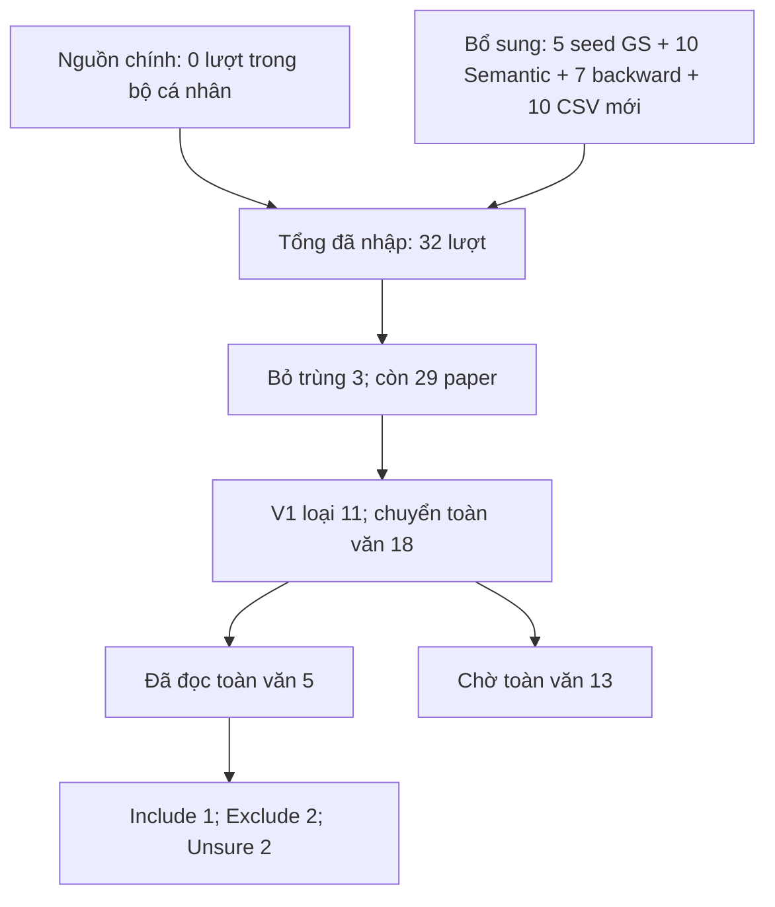

# PRISMA — phần cá nhân T.Duy

Theo quy định nhóm: GS/Semantic và phương pháp bổ sung ghi riêng; không đại diện PRISMA toàn nhóm. Các lượt nhập có nguồn search chưa xác nhận được ghi rõ, chưa được coi là lượt tìm của GS/Semantic.

32−3=29;29=11+18;18=5+13;5=1+2+2. Không cộng 10 dòng re-export vào raw count. 250 Semantic là tổng UI do người dùng báo, không phải số bản ghi đã nhận. Chưa kết luận thất bại truy xuất cuối cùng: reportsNotRetrieved=0; 13 pending. Include cần nhóm xác nhận.
